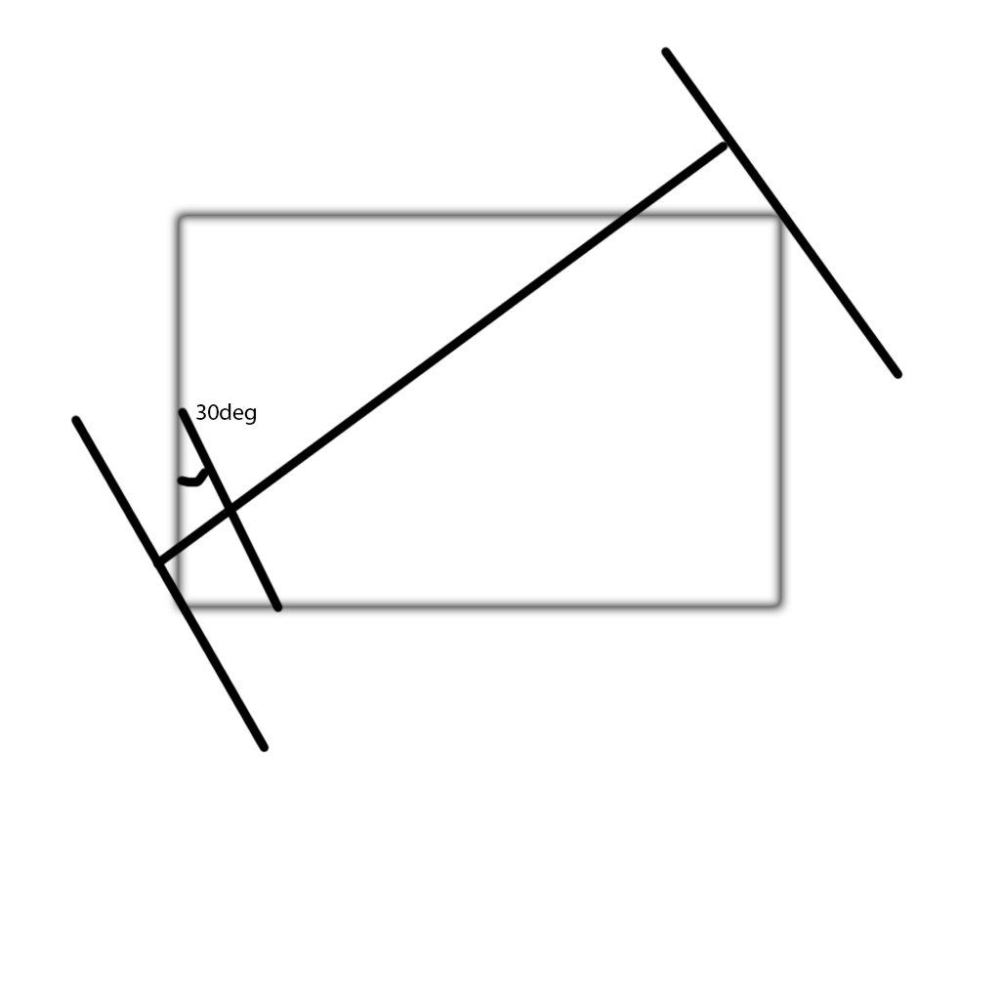
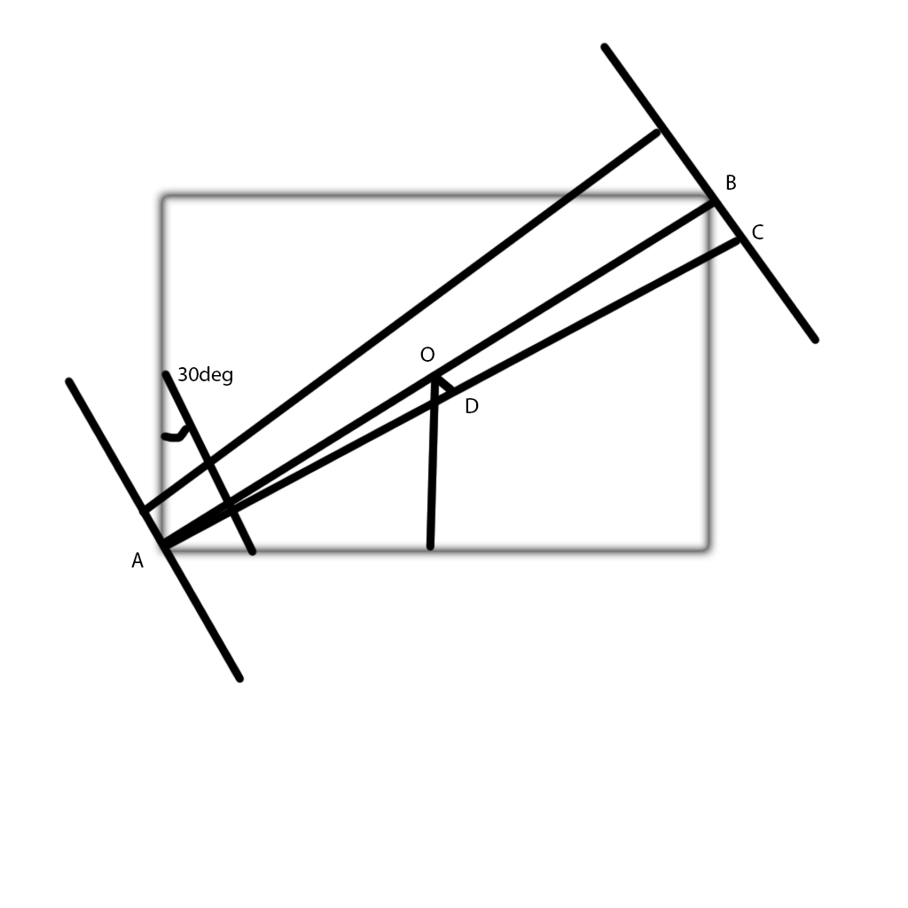
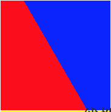
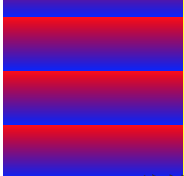
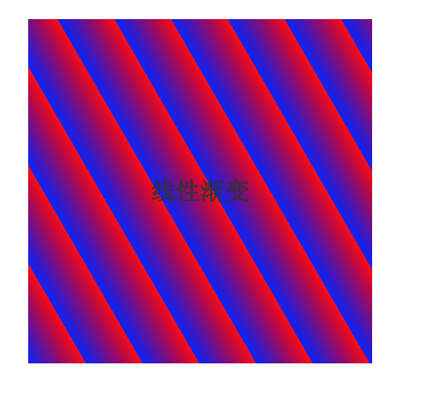

##CSS 线性渐变
这里只讨论w3c的属性，各个浏览器私有实现，这里不讨论，未来的css属性一定会遵照w3c的规定发展的

先看MDN的定义

	渐变线由包含渐变图形的容器的中心点和一个角度来定义的。渐变线上的颜色值是由不同的点来定义，包括起始点，终点，以及两者之间的可选的中间点（中间点可以有多个）。
	
	起始点是渐变线上代表起始颜色值的点。起始点由渐变线和过容器顶点的垂直线之间的交叉点来定义。（垂直线跟渐变线在同一象限内）
	
	同样的，终点是渐变线上代表最终颜色值的点。终点也是由渐变线和从最近的顶点发出的垂直线之间的交叉点定义的，然而从起始点的对称点来定义终点是更容易理解的一种方式，因为终点是起点关于容器的中心点的反射点。

这里首先挑明一点，线性渐变创建了一个呈现线性渐变的<image> 而不是css <color> 这就意味着它会受到 background-repeat 和 background-position 的 调整

MDN 的 API

linear-gradient([angle| to  &lt;side-or-corner>,]?, &lt;color-stop> [, &lt;color-stop>]+ )

举例(*例子里的demo 全在test文件下*)

测试一下两种写法

一个上白下黑渐变的div

linear-gradient(0deg, #000, #fff)

一个左白右黑渐变的div
linear-gradient(to right, #000, #fff)

百分比的渐变
linear-gradient(0deg, #000 40%, #fff 60%)

这里有一种特殊的写法
linear-gradient(0deg, #000 40%, #fff 0);

0相当于无缝衔接上面的40%,等价于 linear-gradient(0, #000 40%, #fff 40%);  

##斜向渐变
先来个简单的经典45度

linear-gradient(45deg, red 15px, blue 15px);

结果是斜向上的 渐变

方向记住很简单，0deg 自下而上 顺时针 45deg  90deg 就好了

我们做个均为30px的单元格，斜分颜色，很多同学这样想，这也特简单了吧，只要

background-image:  linear-gradient(45deg, red 15px, blue 15px);
background-size: 30px 30px 

就好了,其实 NO NO NO

记住我们开始的话，这个时候轴线变了，转了45度，渐变线已经变成bacground-size 的对角线了(background-size 横纵相等)，那平分点就是 30*√2/2了 大约 20 

好了45deg太特殊了，换个60deg的，我们验验真伪

 background-image:  linear-gradient(60deg, red 50%, blue 0);
 
 哦？怎么过了 50% 呢？ 好，我们画个图 看看
  	

	
现在知道为啥过50%了，很简单。对于正方形而言，最长的是那条对角线，那我把上面那条线移到对角线上，你猜中点会落在正方形的中点上吗？

答案肯定是不会啊，不然它不就和对角线平行了吗？那到底是在左边还是右边呢？ 我们再画张图看看

	

一图胜千言，我们看到 D 落在 O 的右边，且垂直A C的轴线 一定在右边了，截图为证

##repeating-linear-gradient

这个简单
举个栗子
repeating-linear-gradient(0deg,blue 0, red 30px);

我们看到它在一个background-size 单元格里进行了填充，等价于
linear-gradient(0deg,blue 0, red 30px,
						 blue 30px, red 60px,
						 blue 60px, red 90px,
						 blue 90px, red 100px);
						 
这个方法简直神作，我们不需要计算60deg,150deg,默认长度是对角线，不再需要√2了，真是解放了 不会三角函数的同学，简单到只要改改角度就好，而不需要原来的liner-gradient 和background-size 简直大块人心

看看效果

**小tips**

注意transparent

linear-gradient 本身一旦形成就不会被覆盖(transparent 除外)

例如            
 background: linear-gradient(90deg, blue 50px, red 80px),
             linear-gradient(90deg, green 50px, purple 80px); 
             
这里是不会出现的purple的，因为这些区域被blue 和 red 已经填满了，不会被覆盖。

*同时*
只要 透明度<1 也会被后面的颜色 覆盖

但是
background: linear-gradient(90deg, blue 50px, transparent 80px),
          linear-gradient(90deg, green 50px, purple 80px);
这里 就会出现purple了，因为transparent把位置空出来了，大家觉得这有什么好讲的，对比一下box-shadow 你就知道了两者异同了
  
                             